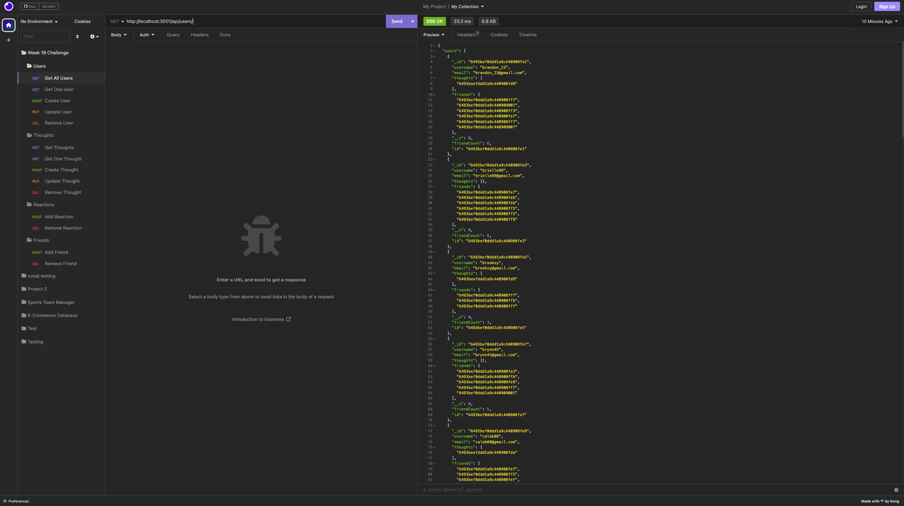
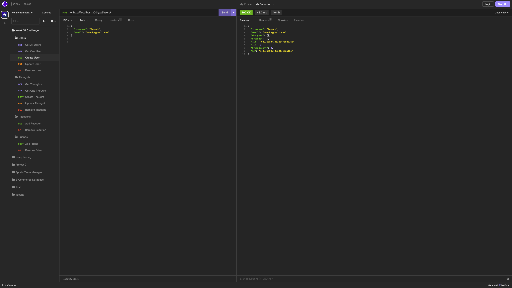
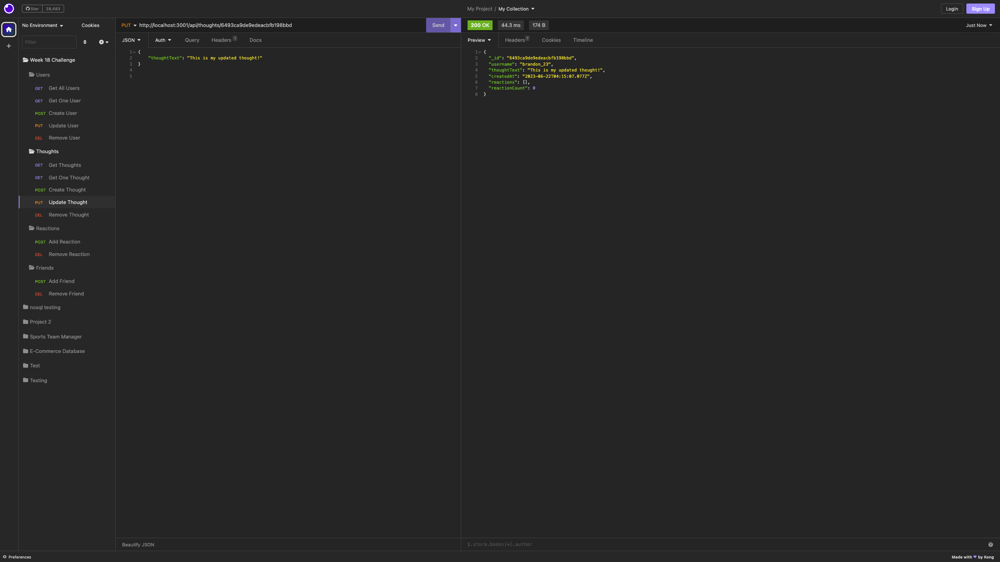

## Social Network API by Elibrer 


*This API can be used as a framework for a Social Network application (such as Facebook or Instagram).*


---

## Languages and packages used
   

---

## Links
> - [GitHub Repository](https://github.com/elibrer/social-network-api)
> 
> - [Link to video walkthrough]()

---

## Contributors
> Elijah Brereton @[GitHub](https://github.com/elibrer)

---

## Table of Contents
- [Description](#description)
- [Installation](#installation)
- [Features](#features)
- [Documentation](#documentation)
- [Application Preview](#application-preview)
- [License](#license)
- [Tests](#tests)
- [Questions](#questions)

---

## Description
If you are looking to create your very own social media networking site, then this API if for you. The API is a framework for a working backend to this type of website, where users can create accounts with username and email, add their friends from the existing user database, post 'thoughts' (which can be changed to anything, e.g. posts, stories, videos, etc), and even react to other thoughts that have been already posted.

---

## Installation
Ensure `insomnia` has been installed on your system. For instructions on how to do this please visit [insomnia.rest](https://insomnia.rest/)

Ensure `mongoDB` has been installed on your system. For instructions on how to do this please visit: [mongodb.com](https://www.mongodb.com/docs/manual/installation/)

Ensure `node.js` has been installed on your system. For instructions on how to do this please visit: [nodejs.org](https://nodejs.org/en). 


Once `node.js` has been installed the user can open the root directory of this application within any console or terminal type program. Check to see if you are in the right location by typing and entering:
```
ls
```
If the root directory is named `social-network-api` and there is a `server.js` file within, the user can then proceed. 

Next, the user may type and enter: 
```
npm install
```
to install all required packages found within the `package.json` file. This will install `mongoose`, `express.js`, and `dayjs`. 


If all of the required packages have been successfully installed the user may proceed by starting the application, typing and entering:

```
node server.js
```
or
```
npm start
```
into the console. If successful, the termial will display 'API server for social-network-api running on port 3001!', meaning the local server is up and running. 

---

## Features
```
- WHEN I enter the command to invoke the application
- THEN my server is started and the Mongoose models are synced to the MongoDB database
- WHEN I open API GET routes in Insomnia for users and thoughts
- THEN the data for each of these routes is displayed in a formatted JSON
- WHEN I test API POST, PUT, and DELETE routes in Insomnia
- THEN I am able to successfully create, update, and delete users and thoughts in my database
- WHEN I test API POST and DELETE routes in Insomnia
- THEN I am able to successfully create and delete reactions to thoughts and add and remove friends to a user’s friend list
```

---

## Documentation
No documentation provided.

---

## Application Preview
### `Get all users`

### `Create User`

### `Update Thought`


---

## License
[Licensed under the MIT license.](https://opensource.org/licenses/MIT)

---

## Tests
To test, seed the database using:
```
npm run seed
```
and try out all of the routes (GET, POST, PUT, DELETE). If any errors come up, or the database is not storing data correctly, please do no hesitate to contact me at my email below. 

---

## Questions
For questions and enquiries, please contact me at: 
[eli.brer@gmail.com](eli.brer@gmail.com)